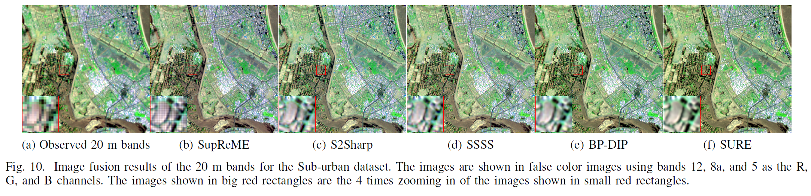

# Deep-SURE-Fusion
 Official Pyorch codes for the paper "Deep SURE for unsupervised remote sensing image fusion", accepted in IEEE Transaction on Geoscience and Remote Sensing (TGRS), October, 2022. 
Han V. Nguyen$^\ast$, Magnus O. Ulfarsson$^\ast$,  Johannes R. Sveinsson$^\ast$, and Mauro Dalla Mura$^\dagger$  
$^\ast$ Faculty of Electrical and Computer Engineering, University of Iceland, Reykjavik, Iceland 
$^\dagger$ GIPSA-Lab, Grenoble Institute of Technology, Saint Martin d’Hères, France.
 Email: hvn2@hi.is
  
  
## Abstract: 
Image fusion is utilized in remote sensing due to the limitation of the imaging sensor and the high cost of simultaneously acquiring high spatial and spectral resolution images. Optical remote sensing imaging systems usually provide images of high spatial resolution but low spectral resolution and vice versa. Therefore, fusing those images to obtain a fused image having both high spectral and spatial resolution is desirable in many applications. This paper proposes a fusion framework using an unsupervised convolutional neural network (CNN) and Stein's unbiased risk estimate (SURE). We derive a new loss function for a CNN that incorporates back-projection mean-squared error with SURE to estimate the projected mean-square-error (MSE) between the fused image and the ground truth. The main motivation is that training a CNN with this SURE loss function is unsupervised and avoids overfitting. Experimental results for two fusion examples, multispectral and hyperspectral (MS-HS) image fusion, and multispectral and multispectral (MS-MS) image fusion, show that the proposed method yields high quality fused images and outperforms the competitive methods.

## Usage: 
The following folders contanin:
- data: The simulated HSI (PU and DC), simulated S2 (APEX) and the S2 real data, and Pledades dataset (Pansharpening).
- models: python scripts define the models
- utils: additional functions 
Run the jupyter notebooks and see results.
## Environment
- Pytorch 1.8
- pytorch_wavelets 1.3
- Numpy, Scipy, Skimage.

## Results
- **Sentinel 2 sharpening**
	+ **APEX dataset**
	
		| SNR=40 (dB)  |         |         |       |        |           |
		|---------|---------|---------|-------|--------|-----------|
		| Metrics | SupReME | S2Sharp | SSSS  | BP-DIP | SURE      |
		| MSRE    | 22.86   | 26.89   | 25.43 | 27.58  | **27.53** |
		| SAM     | 3.855   | 4.25    | 4.914 | 2.421  | **2.533** |
		| MSSIM   | 0.921   | 0.937   | 0.911 | 0.955  | **0.956** |
		| SNR=30  |         |         |       |        |           |
		| MSRE    | 22.34   | 23.13   | 20.6  | 23.72  | **25.85** |
		| SAM     | 4.499   | 5.637   | 9.033 | 3.908  | **2.893** |
		| MSSIM   | 0.905   | 0.896   | 0.836 | 0.906  | **0.94**  |

    + **Real dataset**

